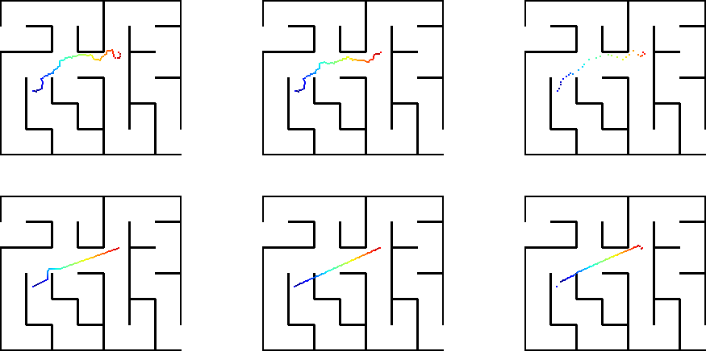
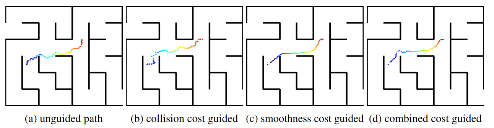
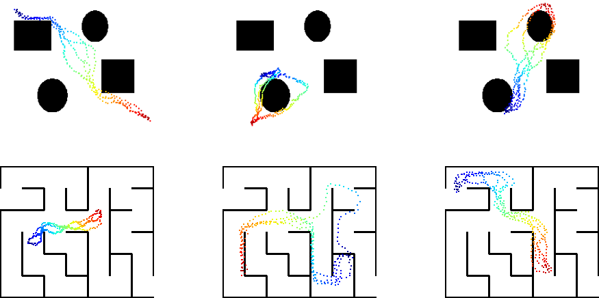
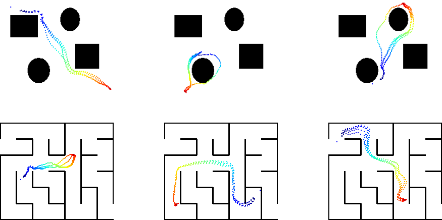
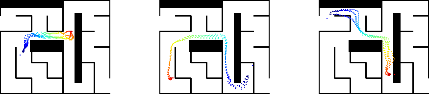

# cs5478 2D Path Planning 

## Usage

#### Plan with Classic Planner
`python3 eval_planner.py [RRT, BiRRT, RRTStar, APF, CHOMP]`

#### Plan with Diffusion Planner
`python3 diffusion_planner.py`

(general posterior)

(task conditioned posterior)

(task conditioned posterior with new obstacles added in the environment)

